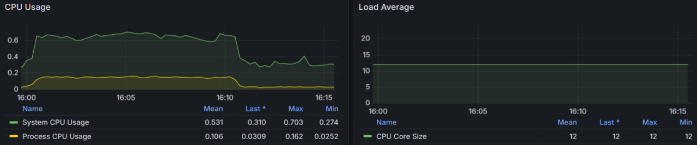
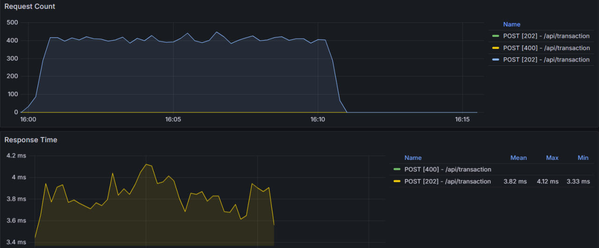
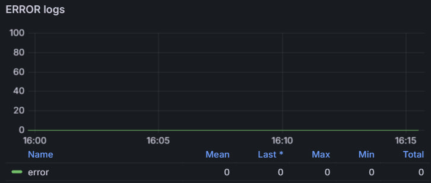

# Сервис уведомлений и отслеживания транзакций

Проект представляет собой backend-ориентированное API-приложение для обработки и хранения транзакций, генерации чеков, отправки уведомлений о совершённых транзакциях.
Сервис задуман как масштабируемый backend-компонент, может быть частью микросервисной архитектуры, но не зависит от UI.

## 📌 Описание

Сервис принимает финансовые транзакции через Kafka, сохраняет их в PostgreSQL и MongoDB, генерирует PDF-чек и загружает его в MinIO (совместимое с S3 хранилище). Также интегрирован сбор метрик в Prometheus с визуализацией в Grafana.

## Архитектура

[User] --> [Auth Controller] --> [PostgreSQL] and generate [JWT Token]

[User] --> [Account Controller] --> [AccountService] --> [PostgreSQL]

[User] --> [Transaction Controller] --> [KafkaProducer] --> [Kafka: transaction-input-topic]
    --> [TransactionService] 
        --> [PostgreSQL]
        --> [Kafka: transaction-mongo-topic] --> [MongoDB]
        --> [Kafka: transaction-notify-topic] --> [Notification Service (план)]
        --> [Kafka: transaction-receipt-topic] --> [PDF Generator] --> [MinIO (S3)]

[User] --> [Receipt Controller] --> [MinIO (S3)] --> [PDF]

## Технологии

- Java 17
- Spring Boot
- Apache Kafka
- PostgreSQL
- MongoDB
- Redis
- MinIO (S3)
- Prometheus + Grafana
- Swagger / OpenAPI
- Docker + Docker Compose

## ✅ Реализовано

- Создание аккаунтов пользователей
- Возможность транзакций между аккаунтами
- Обработка транзакций через Kafka:
  - Приём заявки
  - Валидация и сохранение в PostgreSQL
  - Дублирование в MongoDB
  - Генерация PDF-чека
  - Загрузка чека в S3
- Контроллеры:
  - Регистрация и удаление пользователей
  - Создание транзакций
  - Получение чеков
  - Аутентификация по email и телефону (JWT)
- Swagger-документация всех API
- Интеграция с Prometheus и Grafana (метрики)

## 🔜 Планируется

- Кэширование (Redis)
- Отправка уведомлений (email/SMS)
- Расширение фильтрации и поиска в MongoDB
- Совершенствование контроллеров (Поддержка новых запросов)
- Role-based доступ (RBAC)

## 📊 Метрики

Собираются следующие категории:

- Запросы (общее число, ошибки, длительность, количество)
- Использование памяти, CPU
- Метрики Kafka (в процессе)
- Метрики хранилищ (PostgreSQL, Redis(в процессе), Mongo, S3(в процессе))

Метрики доступны по адресу:  http://localhost:8080/actuator/prometheus
Визуализация: http://localhost:3000/ (admin/admin)

Так же было произведено нагрузочное тестирование при помощи Apache Jmeter(POST: http://localhost:8080/api/transaction)




## 📄 Документация API

Swagger доступен по адресу:
http://localhost:8080/swagger-ui/index.html

## Настройка

```bash
# Клонируем репозиторий
git clone https://github.com/your-username/transaction-notification-service.git

# Запуск
cd transaction-notification-service/start-project
docker-compose up
cd ..
./gradlew bootRun
```
